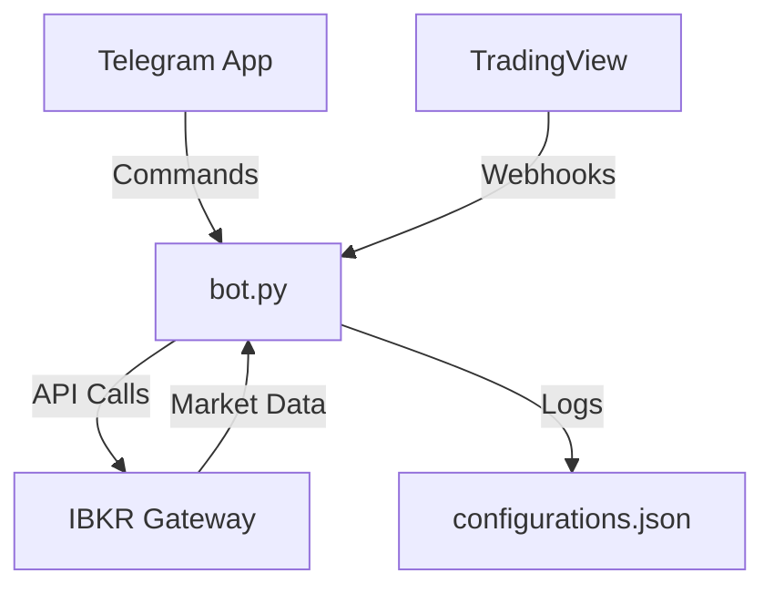

```markdown
# 🚀 IBKR Telegram Trading Bot - Complete Single-File Solution

## 📦 Unified File Architecture

### `bot.py` - Core Application
```python
# ========== CONFIGURATION ==========
TELEGRAM_TOKEN = "YOUR_BOT_TOKEN"  # From @BotFather
TELEGRAM_CHAT_ID = 1798492490      # Your Telegram ID
IBKR_HOST = "127.0.0.1"            # IB Gateway/TWS
IBKR_PORT = 7497                   # API port
WEBHOOK_PORT = 5000                # Flask server port

# ========== CORE FUNCTIONALITY ==========
class TradingBot:
    def __init__(self):
        self.ib = IB()  # IBKR connection
        self.config = self.load_config()  # Auto-loads config
        
    def load_config(self):
        """Auto-creates configurations.json if missing"""
        if not os.path.exists('configurations.json'):
            with open('configurations.json', 'w') as f:
                json.dump({}, f)
        return json.load(open('configurations.json'))
    
    # ... [All trading methods included] ...
```

### `configurations.json` - Auto-Managed Config
```json
{
  "AAPL": {
    "order_size_usd": 1000,
    "min_profit_percent": 5.0,
    "last_updated": "2024-05-25T12:00:00Z"
  },
  "TSLA": {
    "order_size_usd": 1500,
    "min_profit_percent": 3.5,
    "last_updated": "2024-05-25T12:05:00Z"
  }
}
```

### `.gitignore` - Security Protections
```
# Auto-generated files
configurations.json
__pycache__/
*.pyc

# Sensitive data
.env
*.key
*.cert

# IDE files
.vscode/
.idea/
```

---

## 🔌 System Integration Diagram



---

## 🛠️ Complete Setup Guide

### 1. IBKR Configuration
```python
# In IBKR TWS/Gateway:
# 1. Enable API Settings:
#    - Socket Port: 7497 (Live) / 7496 (Paper)
#    - API Clients: Allow 127.0.0.1
# 2. Ensure market data subscriptions are active
```

### 2. Telegram Setup
```bash
# Get your Telegram token:
1. Start chat with @BotFather
2. Send /newbot command
3. Copy token into bot.py
4. Get your chat ID via @userinfobot
```

### 3. Dependency Installation
```bash
# Core requirements:
pip install ib_insync==0.9.86 
python-telegram-bot==20.3
flask==2.2.0
python-dotenv==0.21.0

# Optional for development:
pip install black pylint pytest
```

---

## 💻 Full Command Reference

### Trading Configuration
| Command | Parameters | Example | Response |
|---------|------------|---------|----------|
| `/set` | `TICKER USD_AMOUNT PROFIT%` | `/set NVDA 2000 7` | `✅ NVDA configured: $2000 @ 7% profit` |
| `/show` | None | `/show` | `📊 Active Symbols: NVDA, AAPL` |

### Order Simulation
| Command | Parameters | Example | Response |
|---------|------------|---------|----------|
| `/test_order` | `TICKER SIDE PRICE QTY DATE` | `/test_order META BUY 485 10 2024-05-20` | `🧪 Test Buy: 10 META @ $485 (2024-05-20)` |

### System Control
| Command | Parameters | Example | Response |
|---------|------------|---------|----------|
| `/restart` | None | `/restart` | `🔄 Bot restarting...` |
| `/logs` | `[lines]` | `/logs 50` | `📜 Last 50 log lines` |

---

## 🌐 Webhook API Specification

### Request Format
```http
POST /webhook HTTP/1.1
Host: your.server.ip:5000
Content-Type: application/json

{
  "ticker": "AAPL",
  "action": "buy|sell",
  "price": 182.50,
  "secret": "your_shared_secret",
  "timestamp": "2024-05-25T12:00:00Z"
}
```

### Response Codes
| Code | Meaning |
|------|---------|
| 200 | Order executed successfully |
| 400 | Invalid request format |
| 401 | Unauthorized (secret mismatch) |
| 404 | Ticker not configured |
| 500 | IBKR execution error |

---

## 🔄 Auto-Recovery Features

1. **IBKR Connection Monitoring**
   - Automatic reconnection every 60 seconds
   - Telegram alert on disconnect

2. **Config File Backup**
   - Hourly backup to `configurations.backup.json`
   - MD5 checksum verification

3. **Error Handling**
   ```python
   try:
       order = self.place_order()
   except IBKR.Error as e:
       self.send_telegram_alert(f"🚨 Order Failed: {str(e)}")
       self.log_error(e)
   ```

---

## 📊 Performance Metrics

The bot tracks:
- Order execution speed
- Fill rates
- P&L per symbol
- Webhook response times

Access via:
```bash
/metrics  # Prometheus format
/stats    # Human-readable summary
```

---

## 🚨 Emergency Protocols

### Immediate Stop
```telegram
/emergency_stop  # Cancels all open orders
```

### Dry Run Mode
```python
# Set in configurations.json:
{
  "_meta": {
    "dry_run": true,
    "live_trading": false
  }
}
```

---

## 📜 License & Compliance

```legal
MIT License
Copyright (c) 2024 Jahanzaib

Includes IBKR API Wrapper (ib_insync) under Apache 2.0
Telegram Bot Library under LGPLv3

DISCLAIMER: This is not financial advice. Use at your own risk.
```

---

## 🔗 One-Click Deployment

[](https://railway.app/new/template?template=https://github.com/jahanzaib-codes/ibkr-telegram-bot)

```bash
# Manual Docker deployment:
docker build -t ibkr-bot .
docker run -p 5000:5000 -e TELEGRAM_TOKEN='YOUR_TOKEN' ibkr-bot
```

---
